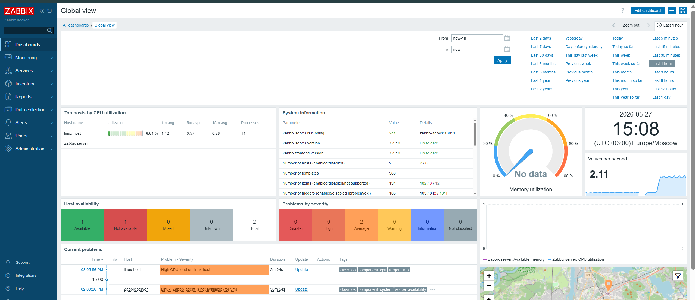

# Zabbix Linux Monitoring Stack

Zabbix 7.4 monitoring stack deployed via Docker Compose with MySQL backend.

## Stack
- Zabbix Server 7.4
- Zabbix Web (Nginx + MySQL)
- Zabbix Agent (Linux host monitoring)
- MySQL 8.0

## Quick Start

```bash
docker compose up -d
```

Web UI: http://localhost:8090  
Login: Admin / zabbix

## What's monitored
- CPU load average (custom trigger: avg > 0.1 for 5m)
- Memory utilization
- Disk usage
- Network interfaces
- System uptime

## Screenshot
